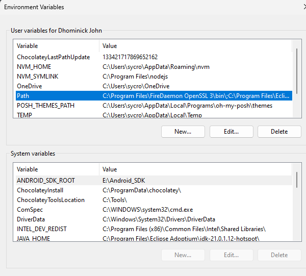

# Project ReDiPoST (Ready PoST)
# Realtime Digital Point System Tracker
#
### By: WVSU Cipher 
#

### Based on operating system types: 

# Windows
### Installation of the needed dependencies
1. JavaScript Package Manager / Environment (Choose one!)
    - Bun : powershell -c "irm bun.sh/install.ps1|iex"
    - NodeJS : Node Package Manager - Fast Node Manager
        - winget install Schniz.fnm # installs fnm (Fast Node Manager)
        - fnm env --use-on-cd | Out-String | Invoke-Expression # configure fnm environment
        - fnm use --install-if-missing 22 # download and install Node.js
        - node -v # should print `v22.9.0` # verifies the right Node.js version is in the environment
2. Vite

        - Node : `npm install vite@latest`
        - Bun  : `bun install vite@latest`

3. Node Version Manager (NVM) 
    - https://github.com/coreybutler/nvm-windows/releases 
        
> ## Important : 
    > A Node Package Manager is important as sooner the project might require some specific version of node for specific modules / packages, comparing the performances of the backend might require comparing version of node to run the backend on if you use `NodeJS`.

4. Powershell
    - Using a terminal shell will make the process working with the backend more smoothly as it is easier to follow through the commands needed for installing the packages.

5. Installing the modules 
    - Bun: 
        > bun install or bun i
    - Npm: 
        > npm install or npm i 

### Installing PHP
- Visit the PHP Webpage to Install latest Version of PHP

        https://windows.php.net/downloads/releases/php-8.3.11-nts-Win32-vs16-x64.zip
- Extract the ZIP folder on the folder of choice. Prefered using C:/php
- Add the PHP Environment variable by Searching `Environment Variables` on your Search Bar or on Control Panel 
> Note: NO Command Here cause I literally destroyed my PC path files creating a script to simplify this process, and yes I destroyed my environment variables using setx and will be reinstalling and yes also my registry! So, don't do it, thanks. :)

#### Figure 1: Environment Variables for PC 

- Open the Path Variable and copy the `C:/php/` and click on the New Button and Paste the Path. 
- Close all cmd windows / powershell windows
- Open a new command window
- Type 
    > php -v 
#

#### Figure 2: PHP Version

## Congrats you've succesfully set-up the project backend! 

# Mac

- To be made if needed :)

# Linux 

- Contact Us Directly: @DhominickJ @Christopher-Glenn @Reiebenezer 

- If you use Gentoo / Arch then, don't consult us. Talk to us, we are willing to learn more from you!
